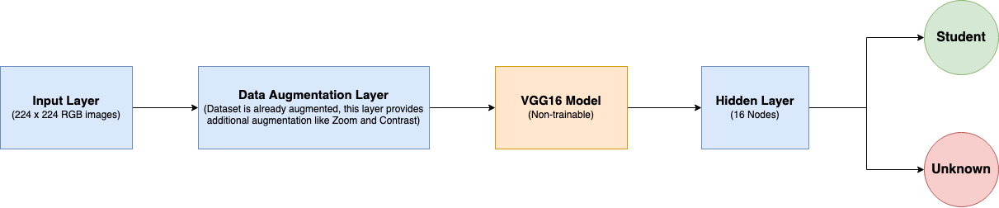
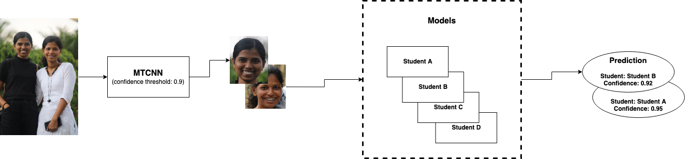

# Attendence Marker
An Attendance Marker is a system that uses AI technology to automatically track attendance for a group of people. The system can be set up to recognize individual faces from a live video and generate an excel sheet marking the attendence.

Using an Attendance Marker with AI has several benefits, including reducing the time and effort required to manually track attendance, improving accuracy and reliability, and freeing up valuable resources for other tasks. Additionally, it can provide insights into attendance patterns and trends over time, which can be useful for making informed decisions about resource allocation and planning.

## Algorithm

### Detection
The face detection is done using the MTCNN model with confidence threshold set to 0.9.

### Recognition

#### Model
Each student is associated with a custom model which has been trained to identify that student. The model takes in faces (of size (224, 224)) and outputs a probability value for Node0 or Node1 - Node0 indicating that the face is recognized and Node1 indicating that it is an unknown face.

#### Dataset Generation
Initially short video of each student (of duration 5-10s) is collected. The frames are extracted from the video and run through MTCNN face detector. The detected face is then cropped and saved under that students folder. Augmenting the data during the preprocessing step has shown to improve the accuracy of the model.

#### Model Architecture
The model at its core is a pre-trained vgg16 model. The vgg16 model has been wrapped with a input layer, data augmentation layer, a hidden layer of 16 nodes and a output layer of 2 nodes corresponding to the student (which that particular model is responsible for) and unknown student.

#### Model Training
While training, say you are training Student_A's model, then a small number of images from other students (B, C ... etc) will be included in the unknown class of Student_A. This decreases the chance of misclassification (like Student A being classified as B).

#### Prediction
During the prediction phase, the cropped face is fed to all the models and each model makes a prediction. If more than one model has recognized the face, the whole prediction is discarded. The face will be marked recognized only if the output of Node0 crosses the threshold value. The recognition threshold is set at 0.9.

## Optimizations
- Models are run in the GPU so as to speed up the process.
- Running each Recognizer model in its own thread has resulted in FPS jumping from 0 to 1.5.
- Currently the MTCNN model runs on CPU, this can be migrated to GPU for better performance.

## Advantages of this Algorithm
- After including the images of other students into the unknown class, the chance of misclassification has been highly reduced. This has resulted in great performance even with the limited images per student.

- If a student is not being recognised or misclassified often, then the model alone can be retrained which would be way faster than to train a model which is responsible for recognising all the students.
    
## Drawbacks of this Algorithm
- Despite utilizing a limited number of 50 recognition models, the process is very slow achieving around 1-2 FPS even when running in a GPU (M1 Pro 14 - core GPU).

## Training params
- The input shape of the image is (224, 224).
- lr starts at 0.0001
- Uses tf.keras.optimizers.Adam optimizer.
- Uses 80-20 train-test split.
- Uses batch size of 8.
- Uses Early Stopping with patience = 3 and monitor = val_loss.
- Trains for a max of 10 epoch, to prevent overfitting.

## How to run this

- Its highly recommended that you create and run this in a conda environment.

- Run `pip install -r requirements.txt` to install the dependencies.

- Follow the instructions inside the folder `datasets` before continuing with this.

- Navigate to the `src` folder and run the `python main.py`, this will generate the database and start training.

- After its done training, you can test you models by running the script `predict.py`.

### About `predict.py`

`usage: predict.py [-h] [--file file] [--preview preview]`

  `--file file        path to the test video`

 ` --preview preview  live video processing, by default the processed video would be saved.`